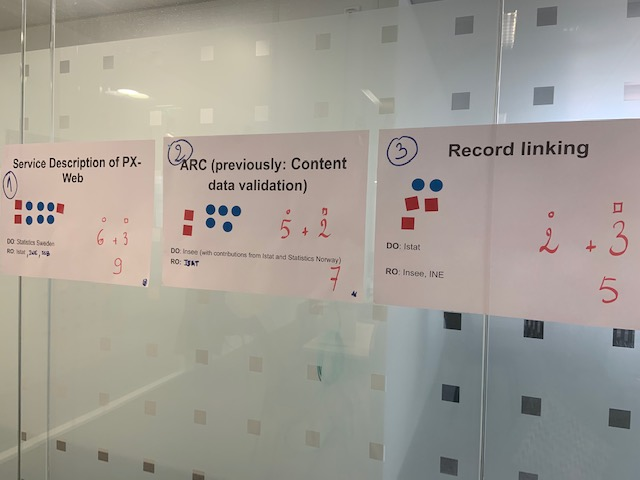

# I3S kick-off meeting

## Minutes

### Tour de table and expectations

Many of the expectations are shared by all the participants in the ESSNet. The project is seen as an opportunity to go forward
in sharing services and an enabler in a context where it is not easy to obtain resources. For those who have not
been part of the first ESSNet, this KO meeting is a good start point to have more information.
The focus put on the architectural aspects and the building of a container platform is appreciated.
Along with the technical questions, the organisational aspects are mentioned:
* how does it work in real life ?
* what can be released in the CSPA catalogue ?
* how to discuss with non-IT people ?
* how to support services after integration ?

### ESSNet Presentation

The I3S (Integrating Shared Statistical Services) ESSNet is following the SCFE ESSnet. Like this
first part, the objectives of the ESSNet are to foster the reuse of statistical services
among the National Statistical Institutes. This secnd part focus more particularly on new services
and technical implementation.

Questions and remarks:
* There is a schedule for the reuse of the service, is reuse in production an explicit goal ? Eurostat answer:
no, it is different from SCFE1, containerizing is important but not exactly linked with developing new services.
* Reusing is also a question of documentatin, organisation... containerization can lower the barrier of deployment in IT system
* SCFE has shown that most of the time was used because of organisational aspects
* tghe ESSNet will have to provide guidelines on how to implement a shared service
* WP4 should provide success stories and not so successful stories. Real stories provide much experience on what are the main difficulties.
* The catalogue is not yet an appstore, we have not already a lot of experience in putting services in the catalogue. With more experiments will come more feedbacks.

### WP1 presentation

Questions and remarks:
* Ror evaluation each DO will have to evaluate its own development regarding the 3 A dimensions, and ROs will evaluate at least 3 services for reuse.
* The methodology developed in WP4 of SCFE1 has been put in a EU Survey, now it is usable by everybody.
* Some services in the list are costly to reuse, or even not possible to reuse. Some could be merged (for example: Data loader and Content validation).
* How to know the desire for the services ? It has been evaluated for some during SCFE1, it is the first A dimension (Attractivity)
* If the service has already an implementation in the CSPA catalogue, it can't be chosen another time for another implementation because it brings nothing in GSBPM coverage.

### WP2 presentation

Questions and remarks:
* the architectural pattern could be a good starting point. What was developed in the architectural pattern Working Group was very theoretical, I3S is a good opportuity to test the patterns
* WP3 looks a lot like a blueprint for WP2. There is a lot of things from WP3 wich could enrich WP2.

### WP3 presentation

### WP3 presentation

### WP4 presentation

Questions and remarks:
* The goal of the communication is to communicate on success stories. To start we should share about what we consider
a success story, to deliver the message to whom, what kind of newsletter...
* A metodology for this WP could be: 1. what is a success story, or a real story ? 2. to focus on which aspects of implementing services ? 3. format : newsletter, hackathon, videos
* LOS ESSNet, hacktahon PLOSH, articles in Digicom Newsletter could be taken as examples
* A hacktahon for WP4 ? In order to work on communication kits, make videos, for example interviewing non IT people (DG ...)
* Good candidates for WP4: jDemetra+, Eno, questionaire from WP4 SCFE
* We could have a visual identity
* WARNING: make the distinction between WP4 and WP5

### Second day: selecting reusable services

**Final results**

| Service | Order | DOs | ROs |
|---|:-:|:-:|:-:|
| PX-web | 1 | SCB | INE (draft), SSB (final) |
| ARC | 2 | Insee (and SSB for VTL) | Istat |
| Record linking | 3 | Istat | Insee |

**The winners**

**The glorious contenders**

### Next steps

**Work package 1**

| What? | Who? | When? | Notes |
|---|:-:|:-:|:-:|
| **Global**|
| Set up a timeline and list of tasks | Every service subproject | As soon as possible | A clear set of milestones |
| Plan collaboration meetings | Every service subproject | By the end of Feb |  |
| Small reports on progress | Every service subproject | |  |
| Common framework of reusing | WP leaders |  | |
|||||
| **PX Web** |
|Learn about current version and perform quick assessment of requirements|INE|March||
|Test the current version (on a Windows platform)|INE|End of March||
|Implementation project on adapting PX-WEB in the existing environment |INE|April||
|Updating to .NET Core based on internal analysis |SCB|Not before summer|Further assessment is needed on internal planning of resources|
|Set up the platform for build and test (including containerization)|SCB|September|Link to WP3|
| **ARC** |
|Document the current architecture and capabilities|Insee|End of February||
|Define the TO-BE Architecture in line with I3S principles|Insee|End of March||
|||||
| **RELAIS** |
|Transfer of knowledge from the current Relais team and the team that will handle the development during the ESSNet |ISTAT|End of March||
|Proposal for a TO-BE Architecture and new implementation of RELAIS service|ISTAT|End of May||
|Plan the development phases|ISTAT|End of May||
|Start the development|ISTAT|June||

**Work package 2**

**Work package 3**

**Work package 4**

